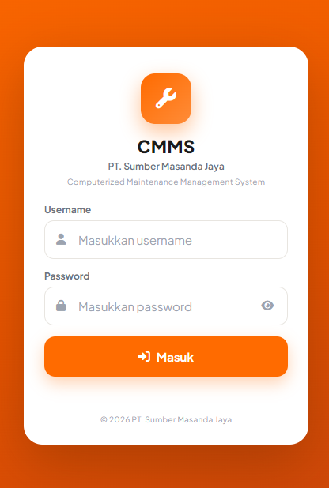
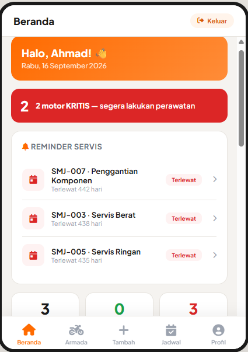

# CMMS — Computerized Maintenance Management System


Aplikasi **Computerized Maintenance Management System (CMMS)** berbasis web + PWA
(installable di HP), dibangun dengan **Laravel 10** dan **SQLite/MySQL**.

## Fitur

- Login 3 level: **Manager**, **Leader**, **Operator**
- Lapor kondisi motor (Ringan/Sedang/Berat) + foto bukti
- Manajemen armada, jadwal servis, tracking pengiriman
- Suku cadang & stok, lokasi (gedung/mesin)
- Laporan berkala, analisis rule-based, riwayat aktivitas
- PWA: bisa diinstall sebagai aplikasi di HP
- Autentikasi session & API JSON

## Kebutuhan Sistem

| Kebutuhan | Versi |
|---|---|
| PHP | 8.1+ |
| Composer | 2.x |
| Database | SQLite (default) atau MySQL/MariaDB 5.7+ |
| Web server | Apache / Nginx / `php artisan serve` |

Ekstensi PHP yang dibutuhkan: `pdo_sqlite` atau `pdo_mysql`, `mbstring`,
`fileinfo`, `openssl`, `json`.

## Tangkapan Layar

> 📸 Tambahkan screenshot aplikasi di sini, contoh:

```


```

## Struktur Penting

```
app/Http/Controllers/CMMSController.php   ← seluruh API backend
routes/web.php                            ← daftar route
resources/views/welcome.blade.php         ← seluruh UI + JavaScript (single file)
database/cmms.sql                         ← dump MySQL siap-import (struktur + data awal)
database/database.sqlite                  ← dibuat otomatis saat instalasi (tidak di-track git)
install.bat / install.sh                  ← auto-installer lokal (Windows / Linux-macOS)
.env_sqlite                               ← template .env untuk lokal (SQLite)
.env.example                              ← template .env untuk deploy (MySQL)
```

---

## 1. Instalasi Lokal (Local)

### Opsi A — Paling cepat (SQLite)

```bash
composer install

# Buat database SQLite kosong (wajib sebelum migrate):
# Windows:
type nul > database\database.sqlite
# Linux / macOS:
touch database/database.sqlite

# Windows:
copy .env_sqlite .env
# Linux / macOS:
cp .env_sqlite .env

php artisan key:generate
php artisan migrate --seed
php artisan serve
```

Buka **http://127.0.0.1:8000** lalu login dengan akun demo di bawah.

### Opsi B — Dengan MySQL

1. Buat database di MySQL, mis. `cmms`.
2. Salin `.env.example` menjadi `.env`, lalu isi bagian database MySQL.
3. Jalankan:

```bash
composer install
php artisan key:generate
php artisan migrate --seed
php artisan serve
```

### Opsi C — Auto-installer (sekali jalan)

Tanpa perlu mengetik perintah satu per satu — skrip otomatis menjalankan
`composer install`, membuat `.env`, generate key, migrasi + seed, lalu
menjalankan server. Cocok untuk instalasi lokal pertama kali.

**Windows:** klik dua kali `install.bat` (atau jalankan `install.bat` dari CMD).

**Linux / macOS:**

```bash
chmod +x install.sh
./install.sh
```

Server langsung berjalan di **http://127.0.0.1:8000** dengan database SQLite.
> Skrip tidak akan menimpa `.env` yang sudah ada, dan melewati `composer install`
> bila `vendor/` sudah terpasang.

---

## 2. Deploy ke VPS

Contoh: Ubuntu + Nginx + PHP 8.1-FPM + MySQL.

### 2.1 Upload project & install dependency

```bash
# upload / git clone project ke /var/www/cmms, lalu:
cd /var/www/cmms
composer install --no-dev --optimize-autoloader
cp .env.example .env
php artisan key:generate
```

Edit `.env`: sesuaikan `APP_URL`, kredensial database MySQL, dan set
`SESSION_SECURE_COOKIE=true`.

### 2.2 Migrasi & permission

```bash
php artisan migrate --seed
php artisan config:clear && php artisan cache:clear

chmod -R 775 storage bootstrap/cache public/uploads
chown -R www-data:www-data storage bootstrap/cache public/uploads
```

### 2.3 Konfigurasi Nginx

```nginx
server {
    listen 80;
    server_name cmms.example.com;
    root /var/www/cmms/public;

    index index.php;
    charset utf-8;

    location / {
        try_files $uri $uri/ /index.php?$query_string;
    }

    location = /favicon.ico { access_log off; log_not_found off; }
    location = /robots.txt  { access_log off; log_not_found off; }

    error_page 404 /index.php;

    location ~ \.php$ {
        fastcgi_pass unix:/var/run/php/php8.1-fpm.sock;
        fastcgi_param SCRIPT_FILENAME $realpath_root$fastcgi_script_name;
        include fastcgi_params;
    }

    location ~ /\.(?!well-known).* {
        deny all;
    }
}
```

Aktifkan & reload:

```bash
sudo ln -s /etc/nginx/sites-available/cmms /etc/nginx/sites-enabled/
sudo nginx -t && sudo systemctl reload nginx
```

### 2.4 HTTPS (opsional, disarankan)

```bash
sudo apt install certbot python3-certbot-nginx
sudo certbot --nginx -d cmms.example.com
```

> `QUEUE_CONNECTION=sync` sudah diatur di `.env`, jadi **tidak perlu** menjalankan
> worker queue di server.

---

## 3. Deploy ke Shared Hosting (tanpa SSH)

Cocok untuk **InfinityFree**, **cPanel**, dsb. Proyek ini sudah menyertakan
`.htaccess` router (root → `public/`) dan route `/setup` untuk migrasi via web.

### 3.1 Persiapan di komputer

```bash
composer install --no-dev
composer dump-autoload --no-dev --no-optimize   # hindari file autoload > 1MB (InfinityFree)
php artisan config:clear && php artisan route:clear && php artisan view:clear && php artisan cache:clear
```

Hapus isi `bootstrap/cache/` dan `storage/framework/{cache,sessions,views}/`
(tinggalkan file `.gitignore`).

### 3.2 Buat `.env` untuk server

Salin `.env.example` → `.env`, lalu isi:

- `APP_KEY` → **WAJIB diisi** (hasil `php artisan key:generate` di lokal). Jangan dikosongkan!
- `APP_URL=https://nama-anda.domain`
- Kredensial database MySQL dari panel hosting
- `SETUP_TOKEN=` dengan string acak panjang
- `SESSION_SECURE_COOKIE=true` (setelah HTTPS aktif)

> ⚠️ JANGAN upload `.env` lokal Anda (yang memakai SQLite / path Windows).
> Buat file `.env` baru khusus server.

### 3.3 Upload via FTP

Upload seluruh isi folder proyek ke `htdocs` (InfinityFree) / `public_html`
(cPanel) — **termasuk folder `vendor/`** (hosting biasanya tanpa Composer).
Aktifkan *Show hidden files* di FileZilla agar `.env` dan `.htaccess` ikut
terupload. Pastikan folder `storage` dan `bootstrap/cache` bisa ditulis server
(permission 755/775).

### 3.4 Isi database (pilih salah satu)

**Cara cepat — import `database/cmms.sql`:**
phpMyAdmin → pilih database → tab **Import** → pilih `database/cmms.sql` → **Go**.

**Cara alternatif — route `/setup`:**
```
https://nama-anda.domain/setup?token=ISI_TOKEN_DARI_ENV
```
Setelah selesai, **kosongkan `SETUP_TOKEN=`** di `.env` lalu upload ulang.

### 3.5 Aktifkan SSL

Aktifkan HTTPS + Force HTTPS di panel hosting (InfinityFree: vPanel → SSL
Certificates → Install, lalu Settings → Force HTTPS).

---

## Akun Demo

| Username | Password | Level | Kemampuan utama |
|---|---|---|---|
| `ahmad` | `manager1` | Manager | Semua fitur: armada, jadwal, user, lokasi, suku cadang, laporan, tracking, lapor kondisi |
| `budi` | `leader1` | Leader | Jadwal, tracking, kelola user (operator), lokasi, laporan, lapor kondisi |
| `cahyo` | `op1` | Operator | Lapor kondisi, tracking pengiriman |

---

## Troubleshooting

| Gejala | Penyebab & Solusi |
|---|---|
| Halaman 404 | `.htaccess` root & public tidak terupload (hosting). Pastikan keduanya ada. |
| Error 500 / halaman kosong | Cek versi PHP (harus 8.1+), `APP_KEY` terisi, `.env` lengkap. Set `APP_DEBUG=true` sementara untuk melihat pesan error. |
| Login gagal padahal password benar | Database belum termigrasi → import `database/cmms.sql` atau jalankan route `/setup` (poin 3.4). |
| Foto tidak tampil | Folder `public/uploads` harus bisa ditulis server. |
| Lambat | Hosting gratis memang lambat untuk Laravel; pertimbangkan VPS murah. |
| Sesi hilang / login tidak tersimpan | `SESSION_SECURE_COOKIE=true` diakses lewat HTTP. Gunakan HTTPS atau kosongkan nilai tersebut. |

---

## Catatan

- Password di `database/cmms.sql` sengaja **plain text** agar mudah import.
  Saat login pertama, aplikasi otomatis meng-upgrade-nya ke **bcrypt**
  (lihat `CMMSController::passwordMatches`).
- Route `/setup` adalah **jalur sekali pakai** — begitu `SETUP_TOKEN` dikosongkan,
  route otomatis 404 (aman dari serangan).
- Foto tersimpan di `public/uploads/photos`.
- Data di hosting gratis tidak di-backup otomatis — rutin download via phpMyAdmin.
- `.env_sqlite` tidak berisi `APP_KEY` (dikosongkan untuk keamanan repo publik) —
  installer dan panduan manual otomatis menjalankan `php artisan key:generate`.
- `database/database.sqlite` tidak di-track git (hanya database lokal Anda).
  Saat clone, buat file kosong dulu lalu `php artisan migrate --seed`
  (auto-installer sudah melakukannya otomatis).

---

## Lisensi

Didistribusikan di bawah lisensi **MIT**. Lihat file [LICENSE](LICENSE) untuk detail.
